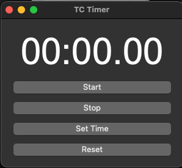

TC - Productivity Timer V0.1 
A python Productivity Timer.

This is the first code I have shared on Github so please be gentle. 

I needed a timer for my productivity when making presets to keep me on track to 10 minutes a preset for my site presetfood.com 
my goal is to try and make 10-30 presets a day and each one takes me roughly 10 minutes. 
I added the functionality to add your own amounts of time to the timer. 

you will need to have PyQt Installed and pyinstaller

this is the bash command i used to make the executible on my mac.
pyinstaller --onefile --noconsole --exclude-module PyQt5.QtNetwork --exclude-module PyQt5.QtSql PyQt_Countdown.py

It should be cross platform if you compile on your platform 

